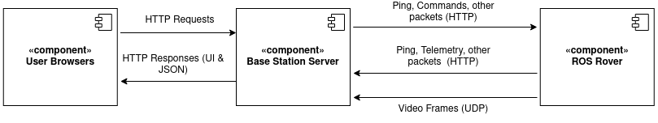

# Base Station Server

## Application Description

This is the base station application that will be used to connect to the rover, send commands to it, receive telemetry, and receive video. The application is a flask server which processes requests from the user (with a web application UI) and the rover which is connected to it. The application exposes an API with different routes according to the feature concerned. The following diagram illustrates the data flow of information between the base station server, rover, and user.



### API Routes

The following Flask API routes are used as follows:
* `/api/hotspot`: Used by UI (the base station person) to control hotspot functionalities
* `/api/joystick`: Used by UI (the base station person) to configure and manage connected joysticks (i.e. joystick for drivetrain and controller for arm)
* `/api/rover`: Used by UI (the base station person) to connect to rover, send commands, ping, stream video, and other requests
* `/connection`: Called by the rover to connect, disconnect, ping, and send telemetry
* `/ui`: Called by the end user, accesses the User Interface of the base station

### Video

The rover sends video to the base station while it is connected. `server/video.py` is used to receive frames from the base station. Frames are sent as UDP segments, which are received and reconstructed to be streamed to `/api/get_video_feed`.

## Requirements

The application runs on **Ubuntu** on **Python 3.8**. The following Python module smust be installed:

```
flask 2.0.2
pygame 2.1.2
```

You can install Python dependencies by running:

```bash
pip3 install -r requirements.txt
```

## Running

Make sure you are in the root directory of the project. Run the following commands to start the base station server"

```bash
export FLASK_APP=server
export FLASK_ENV=development
flask run
```

```powershell
$env:FLASK_APP="server"
$env:FLASK_ENV="development"
$env:FLASK_DEBUG=0
flask run
```